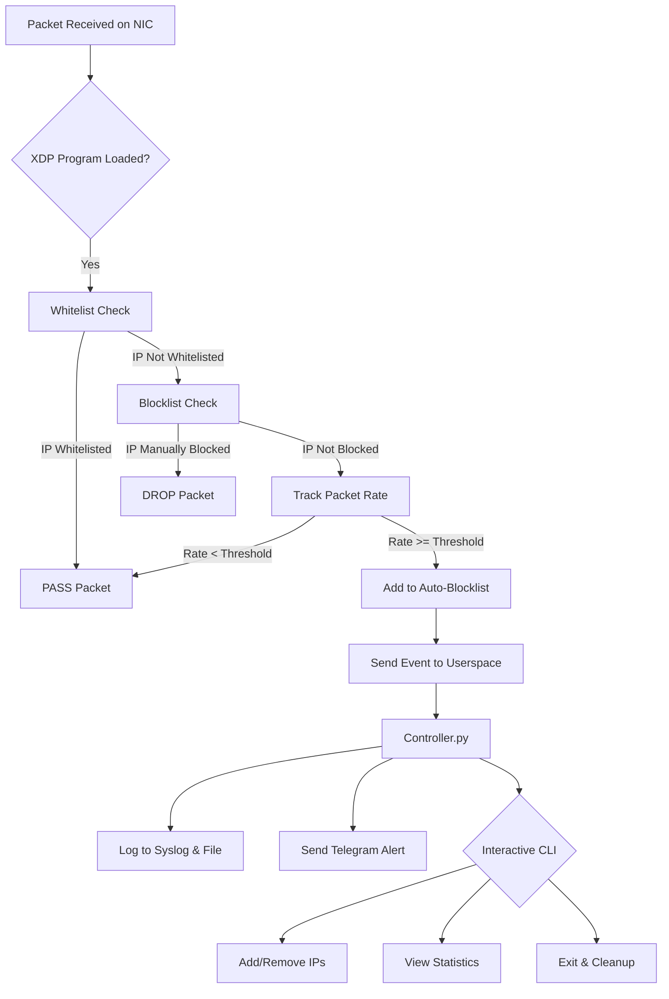

Of course. Here is a professional, comprehensive `README.md` file in Markdown format, ready for your GitHub repository.

---

# XDP/eBPF DDoS Mitigation & Analysis Suite

-blue)


A high-performance, intelligent DDoS mitigation tool built with XDP and eBPF. It filters traffic at the kernel level for maximum efficiency, provides real-time attack analysis, and sends instant alerts to Telegram. Includes a powerful interactive CLI for live system control.

## 🚀 Features

*   **⚡ Kernel-Speed Filtering:** Drops malicious packets using XDP before they hit the network stack, preserving system resources.
*   **🤖 Adaptive Attack Detection:** Dynamically identifies and blocks suspicious IPs based on packet volume and protocol analysis.
*   **📱 Instant Telegram Alerts:** Receives real-time notifications on your mobile device when an attack is detected and mitigated.
*   **🎮 Interactive Command-Line Control:** Manage firewall rules, view statistics, and configure settings on-the-fly without restarting.
*   **📊 Traffic Analysis & Logging:** Monitors and logs all blocked events for later analysis and forensics.
*   **🔒 Secure Configuration:** Uses environment variables to protect sensitive API keys and credentials.

## 🛠️ How It Works

The system employs a multi-layered defense strategy directly in the Linux kernel, orchestrated by a userspace controller.



## 📦 Installation

### Prerequisites
*   **Ubuntu 22.04 LTS** or newer (other distributions may require adjustments)
*   A Linux kernel **5.4** or higher (recommended: **5.15+** for best eBPF feature support)
*   `clang`, `llvm`, `libbpf`, and kernel headers
*   Python 3.8+

### 1. Clone the Repository
```bash
git clone https://github.com/your-username/xdp-ddos-mitigation.git
cd xdp-ddos-mitigation
```

### 2. Install Dependencies
Run the setup script to install all required system and Python dependencies:
```bash
chmod +x scripts/setup.sh
sudo ./scripts/setup.sh
```

### 3. Configure Telegram Alerts (Optional)
1.  Create a bot with [BotFather](https://t.me/BotFather) on Telegram and get your API token.
2.  Message [@userinfobot](https://t.me/userinfobot) to get your Chat ID.
3.  Copy the environment template and add your credentials:
    ```bash
    cp .env.example .env
    nano .env  # Edit with your token and chat ID
    ```

## 🚀 Usage

### Starting the Defense System
Attach the XDP program to your network interface and start the controller. Replace `eth0` with your public-facing interface.
```bash
sudo python3 controller.py -i eth0
# or use make
sudo make run IFACE=eth0
```

### Using the Interactive CLI
Once started, you will see the `ddos-ctl>` prompt. Use the following commands for real-time control:

```bash
# Whitelist Management
wl add 192.168.1.100     # Add an IP to the permanent whitelist
wl remove 192.168.1.100  # Remove an IP from the whitelist
wl list                  # Show all whitelisted IPs

# Blocklist Management
bl add 10.0.0.5          # Manually block an IP address
bl remove 10.0.0.5       # Unblock a manual blocked IP
bl list                  # Show all manually blocked IPs

# Statistics & Info
stats                    # Show current packet statistics
help                     # Show all available commands
exit                     # Detach XDP program and exit safely
```

### Simulating an Attack (For Testing)
Use the provided script to test the system. **Only run this on a machine you own!**
```bash
# Edit the TARGET_IP in scripts/simulate_attack.sh first!
chmod +x scripts/simulate_attack.sh
sudo ./scripts/simulate_attack.sh
```

## ⚙️ Configuration

Key configuration parameters can be modified in the source files:

| Parameter | File | Description | Default Value |
| :--- | :--- | :--- | :--- |
| `PACKET_THRESHOLD` | `xdp_ddos.c` | Min packets/sec to trigger a block | `2000` |
| `BLOCK_TIMEOUT` | `xdp_ddos.c` | How long to block an IP (ms) | `300000` (5 mins) |
| `IFACE` | `controller.py` | Default network interface | `eth0` |

## 📁 Project Structure

```
.
├── controller.py           # Main userspace controller & CLI
├── xdp_ddos.c             # XDP/eBPF program (kernel code)
├── Makefile               # Build and management commands
├── .env.example           # Template for environment variables
├── requirements.txt       # Python dependencies
├── scripts/
│   ├── setup.sh          # Automated dependency installer
│   ├── simulate_attack.sh # Test script (use responsibly)
│   └── helpers.py        # Utility functions
└── logs/
    └── ddos_log.txt      # Auto-generated attack log
```

## 🗺️ Roadmap

-   [ ] **Advanced Detection:** Implement ML-based anomaly detection
-   [ ] **Web Dashboard:** Add a web UI for remote monitoring
-   [ ] **BGP Integration:** Automatically announce blocked prefixes
-   [ ] **Docker Support:** Containerize for easy deployment
-   [ ] **Extended Protocols:** Add specific filters for DNS/NTP amplification attacks

## ⚠️ Disclaimer

**This tool is intended for educational purposes and authorized security testing only.** The authors are not responsible for any misuse or damage caused by this program. Always ensure you have explicit permission to test or protect the network you are using this tool on.

## 📜 License

This project is licensed under the GNU General Public License v3.0. See the [LICENSE](LICENSE) file for details.

## 🤝 Contributing

Contributions, issues, and feature requests are welcome! Feel free to check the [issues page](https://github.com/your-username/xdp-ddos-mitigation/issues).

1.  Fork the project
2.  Create your feature branch (`git checkout -b feature/AmazingFeature`)
3.  Commit your changes (`git commit -m 'Add some AmazingFeature'`)
4.  Push to the branch (`git push origin feature/AmazingFeature`)
5.  Open a Pull Request

## 📞 Support

If you have any questions or run into problems, please open an issue on GitHub.

---

**Happy (and Safe) Hacking!** 🔒